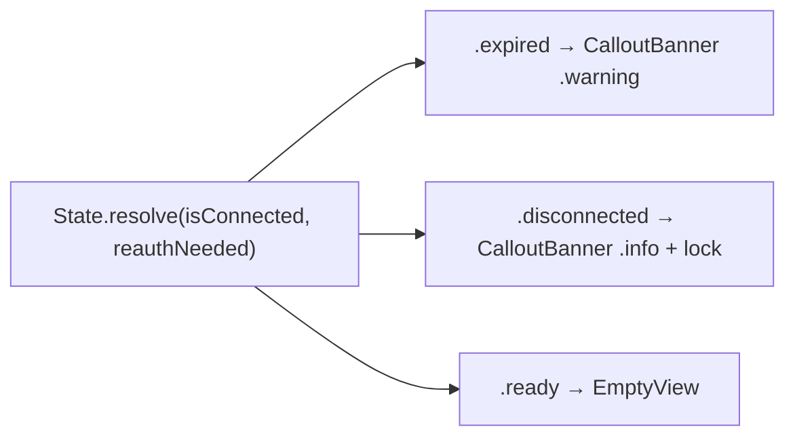

# TwitchConnectionNotice

**File:** [`apps/native/WolfWave/Views/Shared/TwitchConnectionNotice.swift`](../../apps/native/WolfWave/Views/Shared/TwitchConnectionNotice.swift)

## Purpose
Inline gate banner shown when a pane's feature depends on a live Twitch connection. It maps the two Twitch auth flags `(isConnected, reauthNeeded)` to one of three outcomes: an **expired** sign-in renders an orange `.warning` `CalloutBanner`, a never-**disconnected** state renders a blue `.info` banner with a lock glyph, and a connected-and-valid state renders nothing. Centralizes the style/icon/copy split that the Twitch pane's Bot Commands card and the Song Requests pane each hand-rolled (and that had drifted: Song Requests showed the calm "connect" info note even when the sign-in had actually expired). Thin wrapper over [`CalloutBanner`](callout-banner.md).

## API
```swift
TwitchConnectionNotice(
    isConnected: viewModel.channelConnected,
    reauthNeeded: viewModel.reauthNeeded,
    expiredMessage: "Your Twitch sign-in expired. Reconnect above to keep chat commands working.",
    disconnectedMessage: "Connect with Twitch above to let people use these chat commands."
)
```

| Param | Type | Default | Notes |
|---|---|---|---|
| `isConnected` | `Bool` | (required) | Whether Twitch chat is currently connected. |
| `reauthNeeded` | `Bool` | (required) | Whether the stored token expired. Wins over `isConnected` (expired → warning). |
| `expiredMessage` | `String` | (required) | Copy for the orange warning. Keep it feature-specific ("…song requests" vs "…chat commands"). |
| `disconnectedMessage` | `String` | (required) | Copy for the blue info + lock note. |

### State resolution

| `reauthNeeded` | `isConnected` | `State` | Rendered |
|---|---|---|---|
| `true` | any | `.expired` | `CalloutBanner(expiredMessage, style: .warning)` |
| `false` | `false` | `.disconnected` | `CalloutBanner(disconnectedMessage, style: .info, systemImage: "lock.fill")` |
| `false` | `true` | `.ready` | `EmptyView` |

`State.resolve(isConnected:reauthNeeded:)` is a pure static function, unit-tested by `TwitchConnectionNoticeTests`.

## Tokens used
Inherited entirely from [`CalloutBanner`](callout-banner.md): `DSColor.warning` / `.info`, `DSFont.Size.body`, `DSSpace.s1` / `s2` / `s4`, `AppConstants.SettingsUI.cardCornerRadius`. This view adds no chrome of its own.

## Anatomy


## Accessibility
- Inherits `CalloutBanner`'s combined VoiceOver element; the copy carries the meaning, the tint is decorative.
- Both messages should name the feature and the fix ("Reconnect…") so the banner is actionable without sighted context.

## Do / Don't
- ✅ Use it anywhere a feature is gated on Twitch being connected, so the expired-vs-disconnected wording and color stay consistent across panes.
- ✅ Word `expiredMessage` / `disconnectedMessage` for the specific feature and point the user at where to reconnect.
- ❌ Don't re-derive the style from `reauthNeeded` at the call site. Let the component own the split.
- ❌ Don't render it inside a conditional that also checks readiness. It already returns `EmptyView` when ready.

## Example
```swift
TwitchConnectionNotice(
    isConnected: isTwitchConnected,
    reauthNeeded: twitchReauthNeeded,
    expiredMessage: "Your Twitch sign-in expired. Reconnect in Twitch settings to keep song requests working.",
    disconnectedMessage: "Connect with Twitch to enable song requests."
)
```
