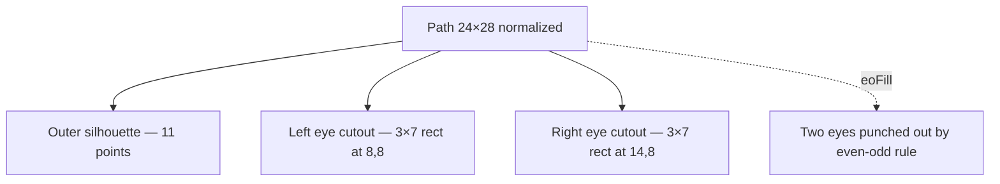

# TwitchGlitchShape

**File:** [`apps/native/wolfwave/Views/Shared/TwitchGlitchShape.swift`](../../apps/native/wolfwave/Views/Shared/TwitchGlitchShape.swift)

## Purpose
SwiftUI `Shape` that draws the official Twitch "Glitch" silhouette — outer speech-bubble polygon + two rectangular eye cutouts. Used as a brand glyph alongside Discord/Apple Music marks.

## API
```swift
TwitchGlitchShape()
    .fill(style: FillStyle(eoFill: true))
    .frame(width: 16, height: 16)
```

No parameters. Path is normalized into the supplied `rect` from a 24×28 reference grid (the official Twitch Glitch proportions).

## Tokens used
- Tint: `DSColor.partnerTwitch` (`#9146FF`) when filled with `.foregroundStyle(...)`
- Standard sizes inside the app: 14pt (inline), 16pt (`IntegrationDashboardView` row), 28pt (onboarding tile)

## Anatomy


## Accessibility
- Decorative shape — give it `.accessibilityHidden(true)` when paired with a labelled control.
- For standalone use, wrap in a labelled container (`Label` or a button with `accessibilityLabel`).

## Do / Don't
- ✅ **Always** fill with `FillStyle(eoFill: true)` — without it the eye cutouts disappear.
- ✅ Use as a `Shape` so it composes with `.fill`, `.stroke`, `.foregroundStyle`, etc.
- ❌ Don't replace with an SF Symbol — there isn't an official one that matches Twitch brand guidelines.
- ❌ Don't rasterize as a PNG asset just to skip the `eoFill` requirement — the vector scales cleanly to any retina size.

## Example
```swift
TwitchGlitchShape()
    .fill(style: FillStyle(eoFill: true))
    .foregroundStyle(DSColor.partnerTwitch)
    .frame(width: 16, height: 16)
    .accessibilityHidden(true)
```
