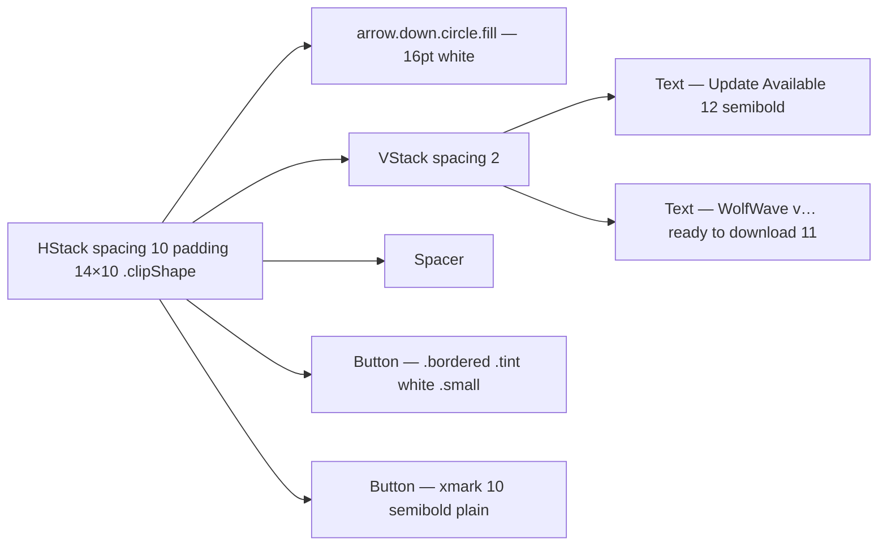

# UpdateBannerView

**File:** [`apps/native/wolfwave/Views/Shared/UpdateBannerView.swift`](../../apps/native/wolfwave/Views/Shared/UpdateBannerView.swift)

## Purpose
Gradient banner shown in Settings when Sparkle has detected a newer version. Self-listening — call `.listening()` to wire it to `updateStateChanged` notifications and forget it.

## API
```swift
UpdateBannerView().listening()
```

No init parameters. The banner observes `NotificationCenter` for `AppConstants.Notifications.updateStateChanged` posts:

```swift
NotificationCenter.default.post(
    name: NSNotification.Name(AppConstants.Notifications.updateStateChanged),
    object: nil,
    userInfo: [
        "isUpdateAvailable": true,
        "latestVersion": "1.2.0",
        "releaseURL": "https://github.com/.../releases/tag/v1.2.0"
    ]
)
```

| userInfo key | Type | Notes |
|---|---|---|
| `isUpdateAvailable` | `Bool` | Required. False hides the banner. |
| `latestVersion` | `String` | Required. Rendered as "WolfWave v\(version) is ready to download." |
| `releaseURL` | `String?` | Optional. Falls back to `AppConstants.URLs.githubReleases`. |

## Tokens used
- `DSColor.brand500` (`#0A84FF`) → purple `LinearGradient` — banner background (currently `.blue` → `.purple` literals; align to brand on next pass)
- `DSFont.Size.body` (12) `.semibold` — title `"Update Available"`
- `DSFont.Size.sm` (11) `.white@85%` — body line
- `DSRadius.lg` (10) — clip shape
- `DSMotion.Duration.base` (0.22) — dismiss `easeOut`
- `.move(edge: .top).combined(with: .opacity)` — entry transition

## Motion

- **Entry** — `.transition(.move(edge: .top).combined(with: .opacity))` when `isUpdateAvailable && !isDismissed` flips true.
- **Dismiss** — `withAnimation(.easeOut(duration: DSMotion.Duration.base))` on tap.
- **Icon attention** — `.symbolEffect(.bounce, value: latestVersion)` on `arrow.down.circle.fill`. A new version arriving (new `latestVersion` string) bounces the icon to draw the eye to the banner. Subsequent re-renders with the same version don't re-trigger.

## Anatomy


## Accessibility
- Download button has `accessibilityHint("Downloads the latest version of WolfWave")`.
- Dismiss button has `accessibilityLabel("Dismiss update banner")`.
- User-dismissed via `isDismissed` local state — re-posted notifications with `isUpdateAvailable: false` also hide it.

## Do / Don't
- ✅ Place at the top of the Settings shell (above the section header for the active tab).
- ✅ Always call `.listening()` — without it the view never sees the notification and stays hidden.
- ❌ Don't trigger the notification from app code outside `SparkleUpdaterService` — that's the contract.
- ❌ Don't render multiple banners; this is a singleton-by-convention UI element.

## Example
```swift
VStack(spacing: 16) {
    UpdateBannerView().listening()
    SettingsContent()
}
```
