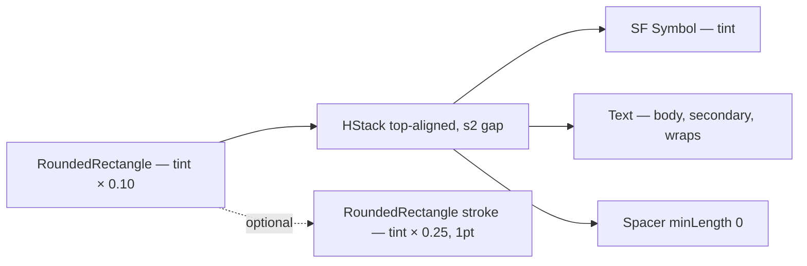

# WarningBanner

**File:** [`apps/native/WolfWave/Views/Shared/WarningBanner.swift`](../../apps/native/WolfWave/Views/Shared/WarningBanner.swift)

## Purpose
Inline tinted callout that flags a warning, caution, or error condition inside a settings pane. Standardizes the `exclamationmark.triangle.fill` + tinted background + rounded-clip pattern that had drifted across the codebase.

## API
```swift
WarningBanner(text: "Token expired — sign in again.")
WarningBanner(text: "Deleting the queue cannot be undone.", tint: .red)
WarningBanner(
    text: "These tools mutate live state. Use at your own risk.",
    strokeVisible: true
)
```

| Param | Type | Default | Notes |
|---|---|---|---|
| `text` | `String` | — | Banner copy. Wraps to multiple lines via `.fixedSize(vertical: true)`. |
| `systemImage` | `String` | `"exclamationmark.triangle.fill"` | Leading SF Symbol. Override only for genuine semantic shifts. |
| `tint` | `Color` | `.orange` | Drives the icon, 10% background fill, and stroke. Use `.red` for destructive. |
| `strokeVisible` | `Bool` | `false` | When `true`, overlays a 1pt stroke at 25% tint. Reserved for high-attention areas (Debug tab). |

## Tokens used
- `DSFont.Size.body` (13)
- `DSSpace.s2` (8) — vertical padding + icon/text gap
- `DSSpace.s4` (12) — horizontal padding
- `AppConstants.SettingsUI.cardCornerRadius` (14) — clip + stroke shape
- Tint: caller passes any `Color`; `.orange` and `.red` are the standard pair

## Anatomy


## Accessibility
- `.accessibilityElement(children: .combine)` collapses icon + text into a single VoiceOver element.
- `.accessibilityLabel(text)` exposes the message verbatim — the icon is `.accessibilityHidden`.
- Tint is **decorative**, not the sole signal — the copy always conveys the meaning.
- Dynamic Type: text uses `.fixedSize(horizontal: false, vertical: true)` so it wraps cleanly.

## Do / Don't
- ✅ Use one banner per warning concern; stack with `DSSpace.s4` spacing.
- ✅ Pair tint with semantic meaning — orange for caution, red for destructive context.
- ✅ Reach for `WarningBanner` before drawing your own warning chrome.
- ❌ Don't embed interactive buttons inside the banner — render the button as a sibling view above or below.
- ❌ Don't set `strokeVisible: true` for routine warnings — reserve the stroke for high-attention surfaces.
- ❌ Don't use for transient toasts — use a separate notification surface.

## Example
```swift
WarningBanner(
    text: "WolfWave can't read the currently playing track. Enable Apple Music automation in System Settings.",
    tint: .orange
)
```
