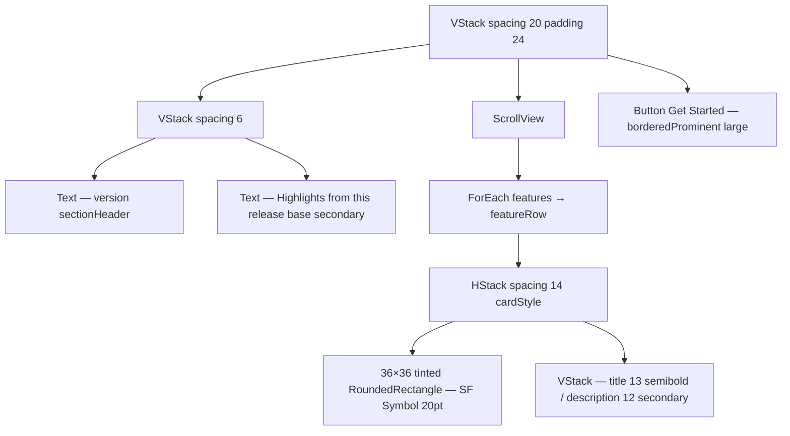

# WhatsNewView

**File:** [`apps/native/WolfWave/Views/Shared/WhatsNewView.swift`](../../apps/native/WolfWave/Views/Shared/WhatsNewView.swift)

## Purpose
"What's New" sheet shown once per version after onboarding completes. Header + scrollable feature list + a single "Get Started" CTA.

## API
```swift
WhatsNewView()
```

Self-contained — no inputs. The version string is read from `Bundle.main.infoDictionary?["CFBundleShortVersionString"]`. The feature list is hardcoded inside the view and updated each release.

## Feature row shape
```swift
(icon: String, iconColor: Color, title: String, description: String)
```

Example entries (current release):
- `"music.mic"` · `.pink` · *Song Requests* — viewers request songs with `!sr`
- `"sparkles"` · `.indigo` · *Liquid Glass Redesign* — refreshed for macOS 26 Tahoe

## Tokens used
- `.sectionHeader()` view modifier — title typography
- `DSFont.Size.base` (13) `.secondary` — header tagline + feature title
- `DSFont.Size.body` (12) `.secondary` — feature description
- `DSFont.Size.lg` (17) `.semibold` icons in 36×36 colour-tinted tiles (`opacity 0.12` background, `DSRadius.md` 8)
- `.borderedProminent` + `.controlSize(.large)` — Get Started CTA
- `.cardStyle()` per row
- `DSSpace.s5`-ish (14) — row internal spacing
- `DSSpace.s7` (20) — outer VStack spacing
- Frame: `idealWidth 420 × idealHeight 540`

## Anatomy


## Accessibility
- Each feature row uses `accessibilityElement(children: .combine)` and labels as `"<title>. <description>"`.
- CTA has `accessibilityIdentifier("whatsNew.getStarted")` and explicit hint.
- Rows have stable identifiers (`whatsNew.feature.<title>`) for UI tests.

## Do / Don't
- ✅ Update the `features` array per release — keep it ≤ 10 entries.
- ✅ Use past-tense, viewer-facing copy in `description`.
- ❌ Don't add a Skip button — `dismiss` is sufficient and matches the Apple sheet idiom.
- ❌ Don't show this sheet without first checking the per-version "shown" flag in `UserDefaults`.

## Example
```swift
.sheet(isPresented: $showWhatsNew) {
    WhatsNewView()
}
```
