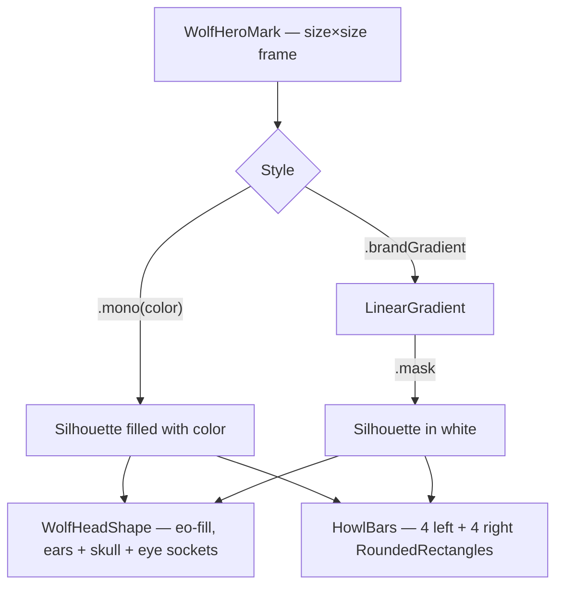

# WolfHeroMark

**File:** [`apps/native/wolfwave/Views/Onboarding/Components/WolfHeroMark.swift`](../../apps/native/wolfwave/Views/Onboarding/Components/WolfHeroMark.swift)

## Purpose
Reusable wolf silhouette + howl-wave bars hero mark. Renders the WolfWave brand language at any size with optional brand-gradient fill and staggered bar entrance animation. Used on the onboarding Welcome + Completion screens; future surfaces (MonthlyWrap, About) will reuse it.

## API
```swift
WolfHeroMark(
    size: 96,
    style: .brandGradient,
    animatedBars: true,
    reduceMotion: reduceMotion
)
```

| Param | Type | Notes |
|---|---|---|
| `size` | `CGFloat` | Square render size in points. Mark scales crisply at any size (vector). |
| `style` | `Style` | `.mono(Color)` for flat tint, `.brandGradient` for Twitch → Discord → Apple Music linear gradient. Default `.mono(.primary)`. |
| `animatedBars` | `Bool` | When `true`, the 8 howl-wave bars run a staggered opacity entrance (inner → outer). Default `false`. |
| `reduceMotion` | `Bool` | Caller forwards `@Environment(\.accessibilityReduceMotion)`. When `true`, bars snap straight to final opacities. Default `false`. |

## Tokens used
- `DSMotion.Duration.slow` (0.32) — bar entrance easing
- Brand colors via `AppConstants.Brand.twitch` / `.discord` / `.appleMusicGradientEnd` (which resolve to `DSColor.partner*`)
- No spacing/radius tokens — geometry is viewBox-derived (`8 2 84 94` from `Resources/widget.html`)

## Motion
- `animatedBars: true` runs a timed opacity fade on the bars after a 120ms entrance delay, using `.easeOut(duration: DSMotion.Duration.slow)`. Each bar's window is a 25% slice of the timeline staggered inner → outer.
- When `reduceMotion` is forwarded as `true` (or `animatedBars` is `false`), bars render at their final opacities immediately. No motion.
- The silhouette itself is static — only the bars move.

## Anatomy


## Accessibility
- Combined element with `accessibilityLabel("WolfWave wolf mark")` — single VoiceOver readout.
- Static silhouette renders identically regardless of motion settings; only bar entrance animation is gated by `reduceMotion`.
- Color is decorative — the mark conveys brand, not state.
- Scales arbitrarily — no Dynamic Type interaction needed (treat as artwork, not text).

## Do / Don't
- ✅ Forward `@Environment(\.accessibilityReduceMotion)` to `reduceMotion` whenever `animatedBars: true`.
- ✅ Use `.brandGradient` on hero surfaces (onboarding Welcome, onboarding Completion, marketing).
- ✅ Use `.mono(.primary)` or `.mono(.secondary)` for in-text-flow decorative use.
- ❌ Don't use sizes < 24 — eye sockets and bar gaps blur. The tray uses a separate raster `TrayIcon` for menu-bar sizes.
- ❌ Don't animate `size` mid-render — vector path is recomputed each frame, which is wasteful.
- ❌ Don't pair with another spinner or checkmark on the same surface — the staggered bars already read as a completion cue.

## Example
```swift
WolfHeroMark(
    size: 96,
    style: .brandGradient,
    animatedBars: true,
    reduceMotion: reduceMotion
)
```
